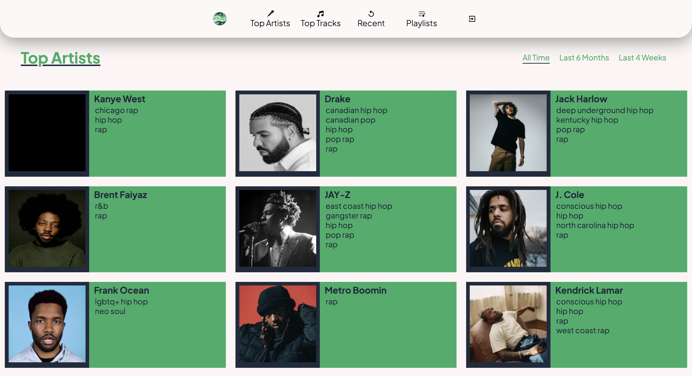

# Music Nexus

## Description

The aim of this project is to make a spotify profile overview/analyzer by using the Spotify API, however the underlying goal of the project was to learning how to incorporate Oauth2.0 in order to access the API resources.

## Features

#### Top Artists Page

List of the top 20 artist for the user that can be sorted by All Time, Last 6 months or Last 4 weeks.

### OAuth2.0 uthentication

Users are required to log in using their spotify accounts in order to use the web app.

Users are directed to a spotify authorization page where the user logs into their account and then accepts the scopes to which the web app will be used. The user is then redirected to the uri provided to the spotify api dashboard, once the user is redirected the code and code verifier are extracted from the url parameters and exchanged in order to get an acceess token, refresh token and token expiration time. The access token is then used throughout the app to fetch data from the spotify API.

### Home Page

Home page contains 3 sections :

* Profile page overview - short overview of profile with user icon, numbers of followers a user has, number of people the user is following (limited to just artist due to API) and number of playlists the user is part of.
* User top tracks section - card displaying the users most listened to track of all time and the user's top 5 tracks of all time
* User top artists section - card displaying the user most listened to artist of all time and user's top 5 artists of all time

### Top Artists Page

List of the user's top 20 artists that can be sorted by either all time, last 6 months or last 4 weeks,

### Artist Page

Artist page contains 3 sections:

* Artist overview - contains artist information such as the genres of music the artist is mostly attributed with, if the user is following the artist, a link to the spotify page of the artist and the amount of total followers the artist has.
* Artist analysis - spotify doesn't have an endpoint for this features therefore the top 10 tracks for the artist are used as seeds to retrieve 10 different analysis which are used to get one average analysis for the artist. The analysis contains the following categories - acousticness, danceability, energy, instrumentalness, liveness, speechiness and valence.
* Artist top tracks - list of the artist's top 10 popular tracks.

### Top Tracks Page

Top tracks page contains 2 sections:

* List of the user's top 20 tracks that can be sorted by either all time, last 6 months or last 4 weeks.
* Recommended tracks section where the user's top 5 tracks are used as seeds in order to retrieve recommended tracks using the recommended spotify endpoint.

### Track Page

Track page contains 3 sections:

* Track overview - contains the name of the album that contains the track, list of artists that are credited on the track, duration of the track and a link to the spotify page of the track.
* Track features - the track id is used to get features of the track which includes key, modality, time signature, tempo, bars, beats, sections, segments
* Track analysis - the track id is used to get analysis of the track which includes acousticness, danceability, energy, instrumentalness, liveness, speechiness and valence

### Recent Page

List of the users 20 most recently listened to tracks. unfortunately the spotify api does not filter out the same song if it is listened to multiple times in a row therefore duplicate tracks might show up.

### Playlists Page

List of all the user's playlists with details such as the owner of the of playlist, number of tracks in the playlist, if the playlist is public or private and if the playlist contains a description it is provided.

### Individual Playlist Page

Playlist page contains 3 sections:

* Playlist overview - contains information such as the owner of the playlist, number of followers the playlist has, number of tracks the playlist has and the full duration of the playlist.
* Playlist analysis - spotify doesn't have an endpoint for this features therefore the track in the playlist are used as seeds to retrieve  different analysis for each track which are used to get one average analysis for the playlist. The analysis contains the following categories - acousticness, danceability, energy, instrumentalness, liveness, speechiness and valence.
* Playlist tracks - contains list of the tracks in the playlist.

    

## Development process

As with my other projects, I started off with basic sketches to get an idea of how I wanted my website to look, this time i decided to take inspiration from spotify itself with exception of using a dark background I wanted to use a light background to contrast the two websites.

The coding section of the development was fairly simple (aside from the oauth implementation, further discussed below) as it involved basic html/javascript/css and react skills that I am proficient in by now

## Challenges

The hardest/longest part of this project was setting up the oauth section of the website and deciding on how to store the tokens. When researching (stackoverflow, spotify community forums,YouTube videos) different ways to store the tokens securely I came to the conclusion that a backend would be required to store the refreshToken in a HTTPonly cookie however seeing as I wanted to created a pure front-end app and not having found any other way to store a refresh token on the front-end without exposing it to security attacks, I decided to not impliment an auto-refreshing function to the app instead opting to forcing the user to manually re authorize the web app.

In the future if I am to improve on this project or build another project using oauth I would include a backend in order to store the token in a more safe manner
